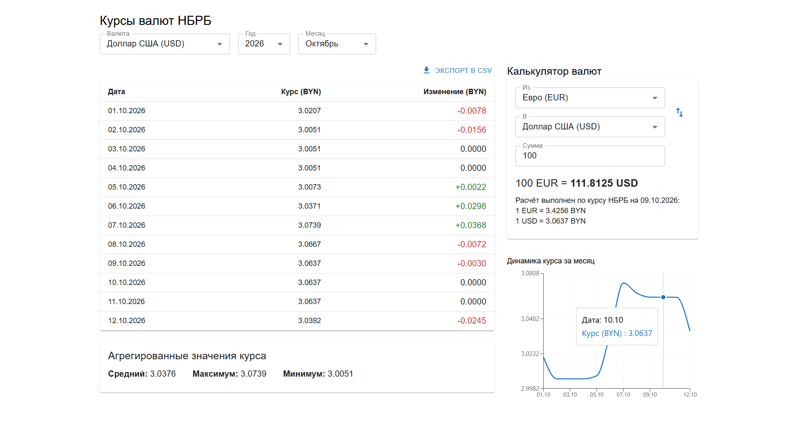
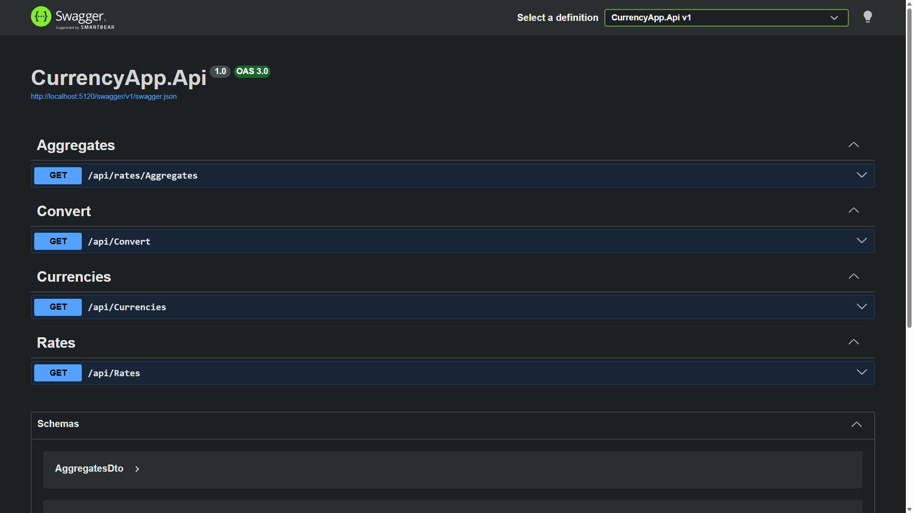

# CurrencyApp — Курсы валют НБРБ

Веб-приложение для просмотра официальных курсов валют Национального банка Республики Беларусь (НБРБ) с возможностью анализа, конвертации и экспорта данных.

## 📋 Функциональность

- **Просмотр курсов** — таблица курсов выбранной валюты за каждый день месяца
- **Анализ изменений** — изменение курса относительно предыдущего дня
- **Агрегаты** — средний, максимальный и минимальный курс за месяц
- **График курса** — линейный график динамики курса за месяц
- **Калькулятор валют** — конвертация между любыми валютами через кросс-курс BYN
- **Экспорт в CSV** — выгрузка таблицы курсов в CSV-файл
- **Кэширование** — текущие курсы кэшируются на 1 час для снижения нагрузки на API НБРБ
- **Два источника данных** — API НБРБ или локальные CSV-файлы

## 🛠 Стек технологий

### Backend
- **.NET 10** / ASP.NET Core
- **Swagger** — документация API
- **CsvHelper** — чтение CSV-файлов
- **IMemoryCache** — кэширование

### Frontend
- **React 19** + **TypeScript**
- **Vite** — сборка
- **MUI (Material UI)** — UI-компоненты
- **TanStack Query (React Query)** — работа с API
- **Axios** — HTTP-клиент
- **Recharts** — график курса
- **PapaParse** — экспорт в CSV

## 🚀 Запуск

### Через Docker

```bash
docker compose up
```

- Backend: [http://localhost:5120](http://localhost:5120)
- Swagger: [http://localhost:5120/swagger](http://localhost:5120/swagger)
- Frontend: [http://localhost:5173](http://localhost:5173)

### Локально (без Docker)

#### Требования
- **.NET 10 SDK** ([скачать](https://dotnet.microsoft.com/download/dotnet/10.0))
- **Node.js 20+** ([скачать](https://nodejs.org/))

#### Клонирование

```bash
git clone https://github.com/alehhuzanau/currency-app.git
cd currency-app
```

#### Backend

В первом терминале:
```bash
cd CurrencyApp.Api
dotnet run
```

#### Frontend

Во втором терминале:
```bash
cd CurrencyApp.Client
npm install
npm run dev
```

## 🔌 Источник данных

В **CurrencyApp.Api/appsettings.json**:
```json
{
  "DataSource": {
    "Type": "Api"
  }
}
```

Возможные значения:
- **`Api`** — данные из API НБРБ (по умолчанию)
- **`File`** — данные из CSV-файлов в `CurrencyApp.Api/Data/`

Значение можно **переопределить** при запуске (без правки файла):
```bash
cd CurrencyApp.Api
dotnet run -- --DataSource:Type=File
```

## 🗂️ Архитектура

```
CurrencyApp/
├── CurrencyApp.Api/                  # Backend (.NET)
│   ├── Constants/                    # Константы
│   ├── Controllers/                  # API-эндпоинты
│   ├── Data/                         # CSV-файлы (для File-режима)
│   ├── Models/                       # DTO
│   ├── Services/                     # Бизнес-логика
│   │   ├── ICurrencyRateSource.cs
│   │   ├── CurrencyRateSourceBase.cs # Общая логика источников
│   │   ├── NbrbApiSource.cs          # Источник — API НБРБ
│   │   └── FileCurrencyRateSource.cs # Источник — CSV
│   └── Validation/                   # Валидация
│
└── CurrencyApp.Client/               # Frontend (React)
    └── src/
        ├── api/                      # HTTP-клиент
        ├── components/
        │   ├── sections/             # Секции страницы
        │   ├── ConverterCard.tsx
        │   ├── RatesChart.tsx
        │   └── ShimmerOverlay.tsx
        ├── hooks/                    # Кастомные хуки
        ├── types/                    # TypeScript-типы
        ├── utils/                    # Утилиты (exportToCsv)
        └── App.tsx
```

## 📡 API

| Метод | Эндпоинт | Параметры | Описание |
|---|---|---|---|
| GET | `/api/currencies` | — | Список доступных валют |
| GET | `/api/rates` | `code`, `year`, `month` | Курсы за месяц |
| GET | `/api/rates/aggregates` | `code`, `year`, `month` | Средний / мин / макс |
| GET | `/api/convert` | `from`, `to`, `amount` | Конвертация |

**Примеры запросов:**

`GET /api/rates/aggregates?code=USD&year=2026&month=9`

`GET /api/rates?code=USD&year=2026&month=9`

`GET /api/convert?from=USD&to=EUR&amount=100`

**Пример ответа:**

```json
{
  "from": "USD",
  "to": "EUR",
  "amount": 100,
  "result": 89.2399,
  "conversionRates": [
    {
      "code": "USD",
      "name": "Доллар США",
      "rate": 3.0371,
      "date": "2026-10-06T00:00:00",
      "scale": 1
    },
    {
      "code": "EUR",
      "name": "Евро",
      "rate": 3.4033,
      "date": "2026-10-06T00:00:00",
      "scale": 1
    }
  ],
  "calculatedAt": "2026-10-05T23:39:02.3842507Z",
  "message": "Расчёт выполнен по курсу НБРБ: 1 USD = 3.0371 BYN (на 06.10.2026); 1 EUR = 3.4033 BYN (на 06.10.2026)."
}
```

## 📸 Скриншоты

| Приложение | Swagger |
|---|---|
|  |  |

## 👤 Автор

**Aleh Huzanau**
- GitHub: [@alehhuzanau](https://github.com/alehhuzanau)